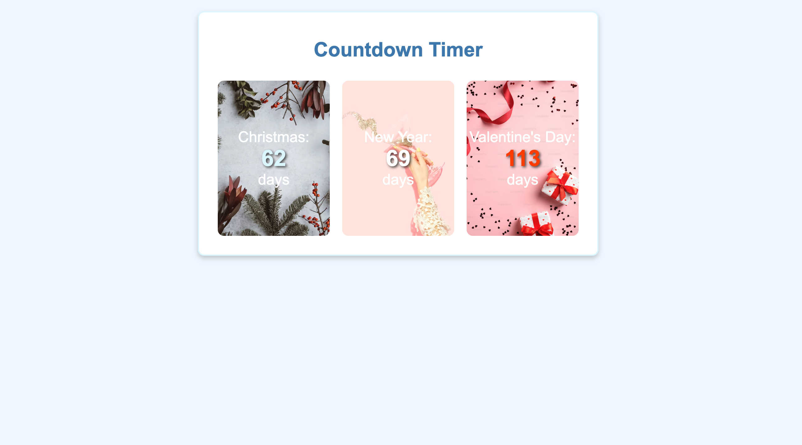
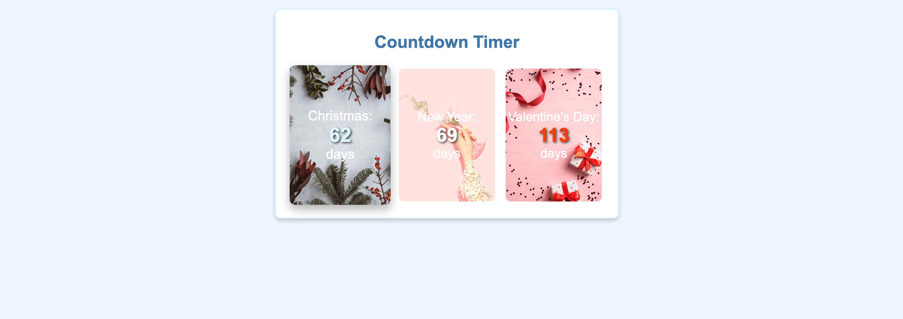
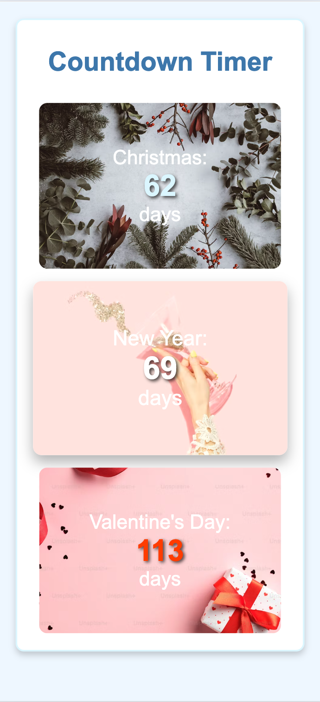

# Countdown Timer

A countdown timer application that displays the time remaining until significant events such as Christmas, New Year, and Valentine's Day. The application features a visually appealing design with responsive layouts for both desktop and mobile devices.

## Table of Contents

- [Installation](#installation)
- [Usage](#usage)
- [Technologies Used](#technologies-used)

## Installation

1. Clone the repository:
   ```zsh
   git clone https://github.com/ewelinaszoda/dalkia-technical-tasks.git
   ```
2. Navigate to the project directory:
   ```zsh
   cd dalkia-technical-tasks
   ```

## Usage

To run the project, open the `index.html` file in your web browser. You can do this by running the following command from the project directory:

```zsh
open index.html
```

This will launch the countdown timer application in your default web browser. The countdown timer will automatically display the time remaining for the specified events. You can customize the events and their dates in the JavaScript file.

## Technologies Used

- **HTML**: For the structure of the web page.
- **CSS**: For styling the application and making it responsive.
- **JavaScript**: For the functionality of the countdown timer, including calculating the time remaining until each event.

## Responsive Design

The application is designed to be responsive, providing different layouts for mobile and desktop/tablet views:

- **Mobile View**:

  - The layout stacks elements vertically to ensure readability and usability on smaller screens. Each countdown item takes up 90% of the width, making it easy to interact with.

  

- **Desktop/Tablet View**:

  - The layout displays countdown items in a row, allowing for a more spacious and organized appearance. Each countdown item takes up 30% of the width, providing a balanced look.

  

### Transitions

The application includes smooth transitions for hover effects on countdown items. When a user hovers over a countdown item, it slightly enlarges and adds a shadow effect, enhancing the visual feedback and interactivity.




